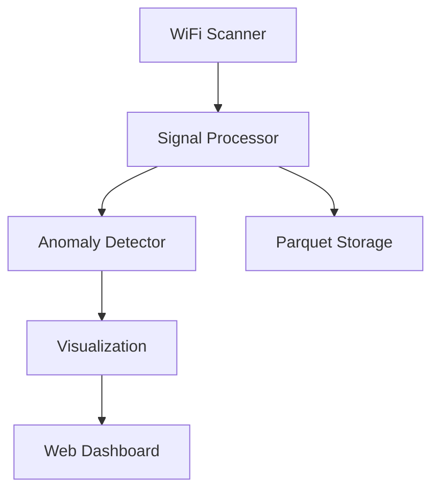

# Enhanced WiFi Mapping & Mesh Networking System


[](https://github.com/psf/black)

A sophisticated WiFi mapping tool with mesh networking capabilities, real-time visualization, and advanced security features.

## 🌟 Features

- **WiFi & BLE Scanning**:
  - Multi-channel hopping
  - Manufacturer filtering
  - Signal heatmaps

- **Secure Mesh Networking**:
  - ECDH key exchange
  - TPM 2.0 integration
  - WireGuard-style tunnels

- **Advanced Visualization**:
  - 2D/3D signal mapping
  - Device clustering
  - Playback mode

- **AI-Powered Analysis**:
  - Anomaly detection
  - Behavior profiling
  - MAC spoofing detection

## 📦 Installation

```bash
# Clone repository
git clone https://github.com/yourusername/wifi-mapper.git
cd wifi-mapper

# Create virtual environment
python -m venv venv
source venv/bin/activate  # Linux/MacOS
venv\Scripts\activate     # Windows

# Install dependencies
pip install -r requirements.txt

# Configure (copy and edit example config)
cp config.example.yaml config.yaml

## 📦 Installation

```bash
# Clone repository
git clone https://github.com/yourusername/wifi-mapper.git
cd wifi-mapper

# Create virtual environment
python -m venv venv
source venv/bin/activate  # Linux/MacOS
venv\Scripts\activate     # Windows

# Install dependencies
pip install -r requirements.txt

# Configure (copy and edit example config)
cp config.example.yaml config.yaml
```

## 🛠️ Configuration

Edit `config.yaml` to customize:

```yaml
# Example configuration
security:
  tpm_enabled: true
  audit_log_rotation: "size"
  
hardware:
  wifi_channels: [1, 6, 11]
  ble_scan_filters:
    manufacturer: "Apple"
```

## 🚀 Usage

### Command Line Interface
```bash
# Start main application
python main.py

# CLI commands available:
# scan --channels 1,6,11 --duration 300
# visualize --3d --playback
# detect --anomalies
```

### Web Dashboard
Access the real-time dashboard at:
[http://localhost:8050](http://localhost:8050)


## 🧰 Development

### Testing
```bash
pytest tests/ --cov=src/ --cov-report=html
```

### Building Docs
```bash
mkdocs build
```

## 📊 Data Flow



## 🤝 Contributing

1. Fork the project
2. Create your feature branch (`git checkout -b feature/AmazingFeature`)
3. Commit your changes (`git commit -m 'Add some amazing feature'`)
4. Push to the branch (`git push origin feature/AmazingFeature`)
5. Open a Pull Request

## 📜 License
